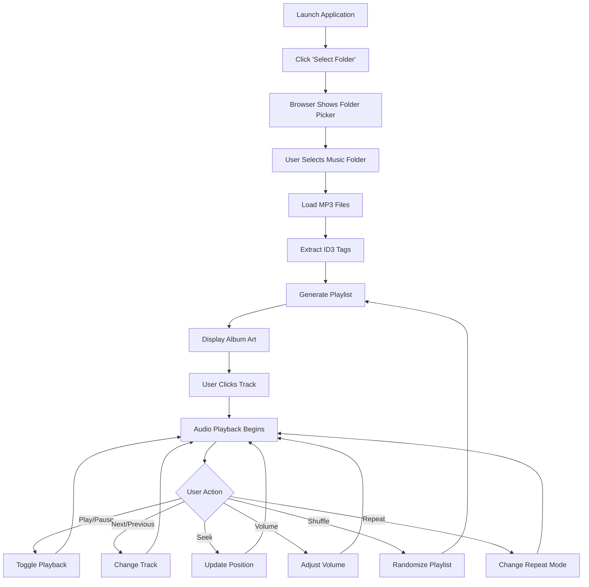
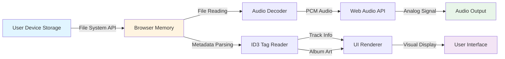

# xsukax Local MP3 Player

[](https://xsukax.github.io/xsukax-Local-MP3-Player)
[](LICENSE)
[](https://developer.mozilla.org/en-US/docs/Web/HTML)
[](https://developer.mozilla.org/en-US/docs/Web/JavaScript)

A modern, privacy-focused, client-side MP3 player that runs entirely in your browser. Built with vanilla JavaScript and styled with Tailwind CSS, this application provides a premium audio experience while keeping your music library completely private and secure.

**[Live Demo](https://xsukax.github.io/xsukax-Local-MP3-Player)** | **[Report Bug](https://github.com/xsukax/xsukax-Local-MP3-Player/issues)** | **[Request Feature](https://github.com/xsukax/xsukax-Local-MP3-Player/issues)**

---

## 📋 Table of Contents

- [Project Overview](#-project-overview)
- [Security and Privacy Benefits](#-security-and-privacy-benefits)
- [Features and Advantages](#-features-and-advantages)
- [Installation Instructions](#-installation-instructions)
- [Usage Guide](#-usage-guide)
- [Technology Stack](#-technology-stack)
- [Browser Compatibility](#-browser-compatibility)
- [License](#-license)
- [Contributing](#-contributing)
- [Support](#-support)

---

## 🎵 Project Overview

**xsukax Local MP3 Player** is a sophisticated, browser-based audio player designed for users who value privacy and control over their music collection. Unlike cloud-based streaming services or traditional desktop applications, this player operates entirely within your web browser, processing audio files locally without any server communication or data transmission.

The application features a sleek, glassmorphic user interface with comprehensive playback controls, ID3 tag reading capabilities for metadata extraction, dynamic album art display, and intelligent playlist management. It supports standard MP3 playback features including shuffle, repeat modes, progress seeking, and volume control, all while maintaining a zero-footprint approach to data storage and transmission.

### Primary Functionalities

- **Local File System Access**: Direct folder selection and MP3 file loading from your device
- **Metadata Extraction**: Automatic reading of ID3 tags for track title, artist, album, and embedded artwork
- **Playlist Management**: Dynamic playlist generation with shuffle and repeat capabilities
- **Playback Controls**: Full-featured audio controls including play/pause, next/previous, seek, and volume adjustment
- **Visual Feedback**: Real-time progress tracking, dynamic album art display, and elegant gradient backgrounds
- **Keyboard Shortcuts**: Spacebar support for quick play/pause toggling

---

## 🔒 Security and Privacy Benefits

The xsukax Local MP3 Player is architected with a privacy-first philosophy, ensuring that your personal music library remains completely confidential and secure:

### Client-Side Processing Only

All audio processing, metadata reading, and playback operations occur exclusively within your browser's sandboxed environment. **No data is ever transmitted to external servers**, eliminating risks associated with data interception, unauthorized access, or third-party tracking.

### Zero Data Collection

The application does not collect, store, or transmit any user information, listening habits, or music library metadata. There are no analytics scripts, tracking pixels, or telemetry systems integrated into the codebase, ensuring complete anonymity during use.

### No Authentication Required

Users can access and utilize all features without creating accounts, providing email addresses, or sharing personal information. This eliminates the risk of credential breaches and identity exposure.

### File System API Security

The application leverages the browser's secure File System Access API, which enforces strict user permission controls. Files are accessed only with explicit user consent through native browser dialogs, and file handles are created as temporary blob URLs that exist only for the duration of the session.

### Ephemeral Data Handling

All loaded audio files and metadata are stored exclusively in browser memory (RAM) and are automatically cleared when you close the browser tab or window. No persistent storage mechanisms (localStorage, sessionStorage, IndexedDB, or cookies) are utilized.

### No Third-Party Dependencies for Core Functionality

While the application uses CDN-hosted libraries (Tailwind CSS and jsmediatags), all critical audio processing and playback logic is implemented using native Web APIs, reducing the attack surface and dependency vulnerabilities.

### HTTPS Deployment

When hosted on GitHub Pages or any HTTPS-enabled server, all communications between your browser and the hosting infrastructure are encrypted, preventing man-in-the-middle attacks.

### Open Source Transparency

The complete source code is publicly available for security auditing, allowing the developer community to verify the absence of malicious code or privacy-compromising features.

---

## ✨ Features and Advantages

### Core Features

- **🎨 Modern Glassmorphic UI**: Beautiful gradient backgrounds with frosted glass effects and smooth animations
- **📁 Folder-Based Loading**: Load entire music folders with a single click
- **🎼 ID3 Tag Support**: Automatic extraction of track metadata (title, artist, album, artwork)
- **🖼️ Dynamic Album Art**: Displays embedded artwork or generates elegant gradient backgrounds
- **🔀 Shuffle Mode**: Randomize your playlist for varied listening experiences
- **🔁 Repeat Modes**: Off, Repeat All, or Repeat One track
- **⏯️ Intuitive Controls**: Play, pause, next, previous with visual feedback
- **📊 Progress Tracking**: Real-time progress bar with seek functionality
- **🔊 Volume Control**: Smooth volume slider with live percentage display
- **⌨️ Keyboard Shortcuts**: Spacebar for play/pause control
- **📱 Responsive Design**: Optimized for desktop, tablet, and mobile devices
- **🌈 Color-Coded Tracks**: Unique gradient colors generated for each track

### Advantages Over Alternatives

| Feature | xsukax Local MP3 Player | Cloud Streaming Services | Desktop Players |
|---------|-------------------------|--------------------------|-----------------|
| **Privacy** | ✅ Complete | ❌ Data collected | ⚠️ Varies |
| **No Installation** | ✅ Browser-based | ⚠️ App required | ❌ Installation needed |
| **Offline Access** | ✅ Fully offline | ❌ Requires internet | ✅ Offline |
| **No Subscription** | ✅ Free forever | ❌ Often paid | ✅ Usually free |
| **Cross-Platform** | ✅ Any modern browser | ⚠️ Platform-specific | ⚠️ OS-dependent |
| **No Account Required** | ✅ Anonymous | ❌ Login required | ✅ No account |
| **File Format Support** | MP3 only | Various | Various |

---

## 💾 Installation Instructions

### Prerequisites

- A modern web browser (Chrome 86+, Firefox 82+, Safari 14+, Edge 86+)
- Local MP3 files stored on your device

### Method 1: Use the Live Demo (Recommended)

Simply visit the hosted version at **[https://xsukax.github.io/xsukax-Local-MP3-Player](https://xsukax.github.io/xsukax-Local-MP3-Player)** and start using the application immediately—no installation required.

### Method 2: Clone and Run Locally

1. **Clone the repository**:
   ```bash
   git clone https://github.com/xsukax/xsukax-Local-MP3-Player.git
   cd xsukax-Local-MP3-Player
   ```

2. **Open the application**:
   - Simply double-click `index.html` to open it in your default browser, or
   - Right-click `index.html` → Open With → Choose your preferred browser

3. **Start using the player**:
   - No build process, compilation, or dependencies to install
   - The application runs entirely in your browser

### Method 3: Deploy to Your Own Server

1. **Upload the file**:
   ```bash
   # Copy index.html to your web server
   scp index.html user@yourserver.com:/var/www/html/
   ```

2. **Access via web browser**:
   ```
   https://yourserver.com/index.html
   ```

### Method 4: Use as a Standalone PWA (Progressive Web App)

While the current version doesn't include a service worker, you can bookmark the page in your browser for quick access:

1. Open the application in your browser
2. Click the bookmark icon or press `Ctrl+D` (Windows/Linux) or `Cmd+D` (Mac)
3. Access anytime from your bookmarks

---

## 📖 Usage Guide

### Getting Started

1. **Launch the Application**
   - Open `index.html` in your browser or visit the [live demo](https://xsukax.github.io/xsukax-Local-MP3-Player)

2. **Load Your Music**
   - Click the **"Select Folder"** button in the playlist panel
   - Choose a folder containing MP3 files from your device
   - The application will automatically load all MP3 files and extract metadata

3. **Start Listening**
   - Click any track in the playlist to start playback
   - Use playback controls to manage your listening experience

### Application Workflow



### Control Reference

#### Playback Controls

- **▶ Play/Pause Button**: Start or pause the currently selected track
- **⏮ Previous Button**: Skip to the previous track (or restart current track if more than 3 seconds have elapsed)
- **⏭ Next Button**: Skip to the next track in the playlist
- **Progress Bar**: Click or drag to seek to a specific position in the track
- **Volume Slider**: Adjust playback volume (0-100%)

#### Playlist Features

- **🔀 Shuffle**: Randomize the playback order (blue highlight when active)
- **🔁 Repeat Modes**:
  - **Off**: Stop after the last track
  - **All**: Loop the entire playlist
  - **One**: Repeat the current track continuously

#### Keyboard Shortcuts

- **Spacebar**: Toggle play/pause

### Data Flow Architecture



### Metadata Display

The player automatically displays:
- **Track Title**: Extracted from ID3 tags or derived from filename
- **Artist Name**: From ID3 tags or shown as "Unknown Artist"
- **Album Name**: From ID3 tags (if available)
- **Album Artwork**: Embedded images or dynamically generated gradients
- **Track Duration**: Calculated during file loading
- **Current Position**: Real-time playback progress

### Tips for Best Experience

1. **Organize Your Music**: Keep MP3 files in dedicated folders for easier loading
2. **Use ID3 Tags**: Properly tagged MP3 files provide richer metadata and album art
3. **Supported Formats**: Only MP3 files are supported (MPEG Audio Layer 3)
4. **Browser Compatibility**: Use the latest version of your browser for optimal performance
5. **File Size Considerations**: Very large playlists (500+ tracks) may take longer to load initially

---

## 🛠️ Technology Stack

- **HTML5**: Semantic markup and structure
- **CSS3**: Custom styling with glassmorphic effects
- **JavaScript (ES6+)**: Core application logic and DOM manipulation
- **Tailwind CSS**: Utility-first CSS framework via CDN
- **jsmediatags**: ID3 tag reading library for metadata extraction
- **Web Audio API**: Native browser audio playback engine
- **File System Access API**: Secure folder and file selection

---

## 🌐 Browser Compatibility

| Browser | Minimum Version | Status |
|---------|----------------|--------|
| Google Chrome | 86+ | ✅ Fully Supported |
| Mozilla Firefox | 82+ | ✅ Fully Supported |
| Safari | 14+ | ✅ Fully Supported |
| Microsoft Edge | 86+ | ✅ Fully Supported |
| Opera | 72+ | ✅ Fully Supported |
| Brave | 1.15+ | ✅ Fully Supported |

**Note**: The File System Access API requires user permission and may not be available in older browser versions or certain privacy-focused configurations.

---

## 📄 License

This project is licensed under the GNU General Public License v3.0.

---

## 🤝 Contributing

Contributions, issues, and feature requests are welcome! Feel free to check the [issues page](https://github.com/xsukax/xsukax-Local-MP3-Player/issues).

### How to Contribute

1. Fork the repository
2. Create your feature branch (`git checkout -b feature/AmazingFeature`)
3. Commit your changes (`git commit -m 'Add some AmazingFeature'`)
4. Push to the branch (`git push origin feature/AmazingFeature`)
5. Open a Pull Request

---

## 🌟 Acknowledgments

- Icons and UI inspiration from modern design trends
- Built with ❤️ for music lovers who value privacy

---

<div align="center">

**[⬆ Back to Top](#xsukax-local-mp3-player)**

Made with 🎵 by [xsukax](https://github.com/xsukax)

If you find this project useful, please consider giving it a ⭐ on GitHub!

</div>
